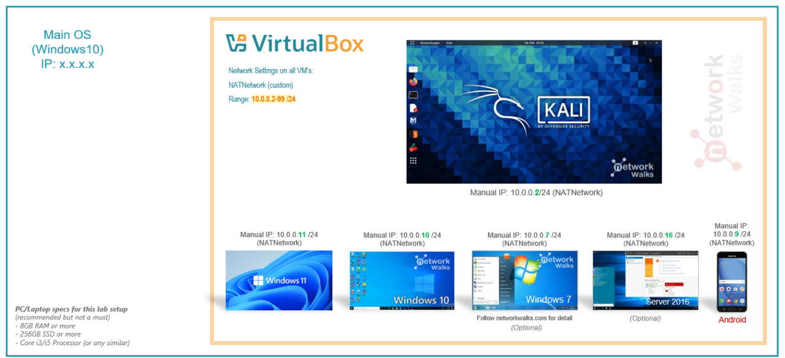
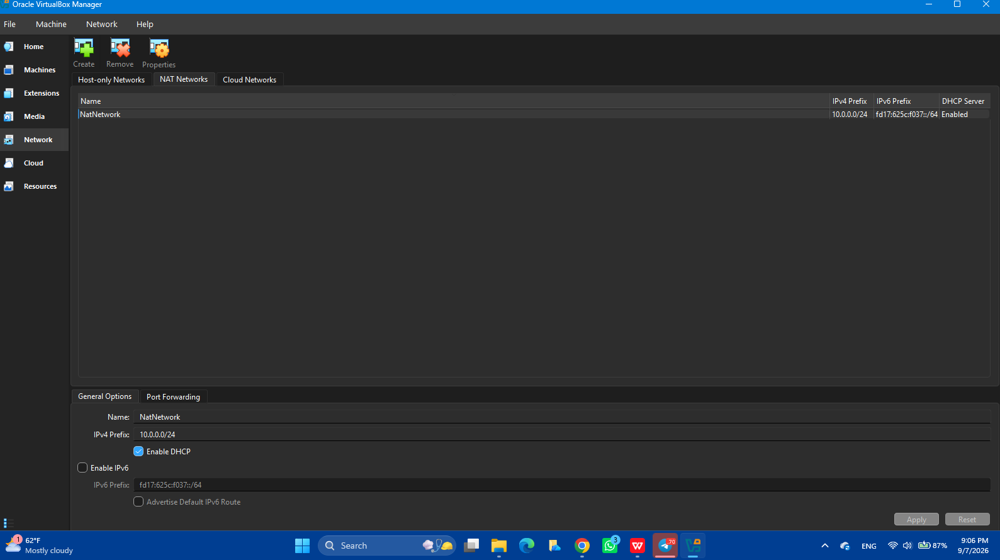
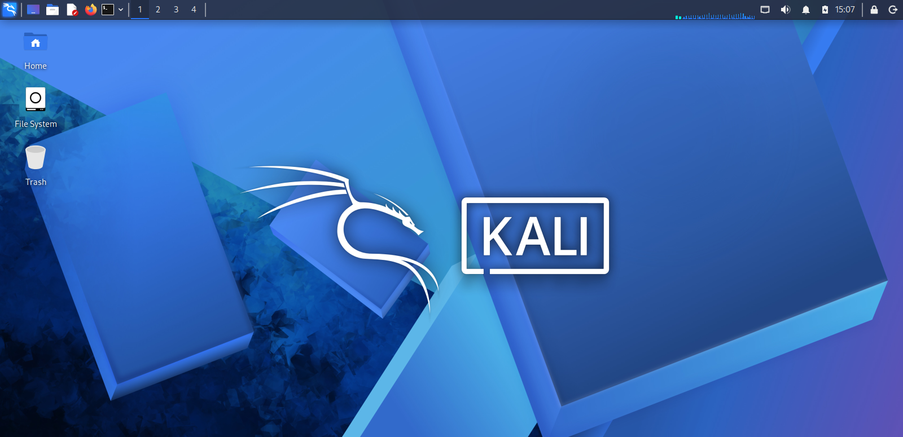
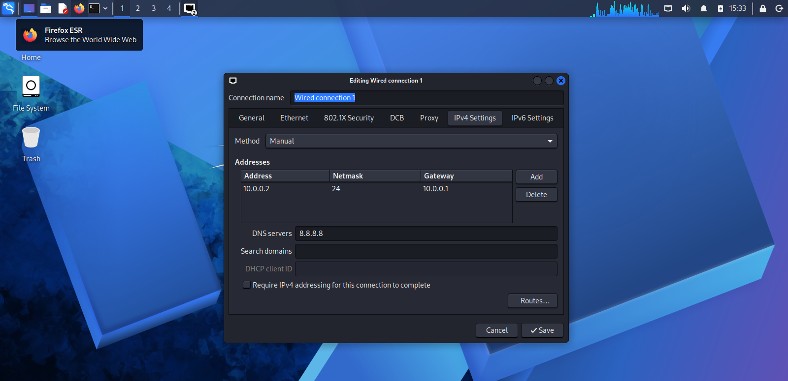
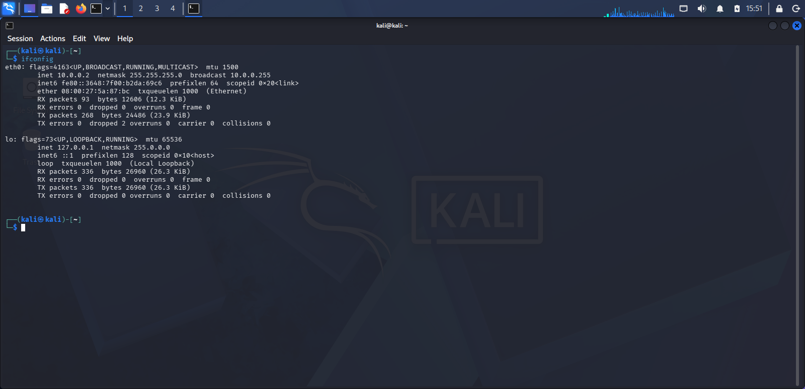
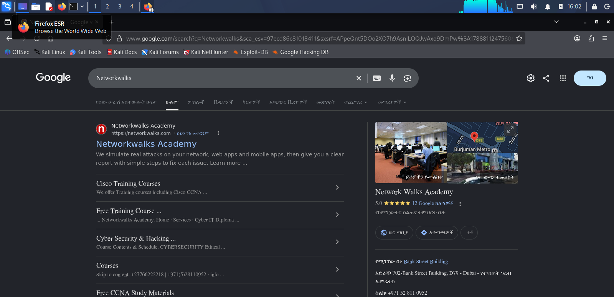
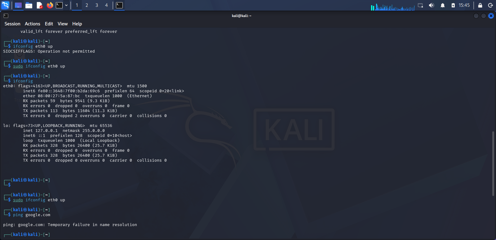

#           NETWORKWALKS-B083-WK1-PM1-CYBERSECURITY-LAB-SETUP
Isolated virtual lab built with VirtualBox and Kali for cybersecurity and penetration testing practice

## 🔐 Cyber security Lab Environment Setup

### 📌 Overview
This project sets up a virtual cybersecurity and penetration testing lab using VirtualBox and Kali Linux. Its purpose is to create a sandbox for testing different cybersecurity tools, along with network scanning and vulnerability assessments. It's configured on a private virtual network so other machines can be added later to practice authorized security testing.

### 🎯 Objectives
The main objectives of this project are to:

- Install and configure VirtualBox
- Install/import Kali Linux as a virtual machine
- Create a private NAT Network for the cybersecurity lab
- Configure network connectivity for Kali Linux
- Assign a consistent IP address to the Kali VM
- Verify network connectivity and DNS resolution
- Document the complete setup process
  
### 🛡️ Why This Lab Exists
Before running any security tool against a real target, I need somewhere safe to break things without breaking anything that matters. That's what this setup provides a closed off network where Kali Linux can scan, and test without ever touching the outside world. Everything here stays contained to machines I own or have permission to test.

⚠️ Important: this lab must only be used for systems you own or have explicit permission to test never against unauthorized systems.

This setup leaves room to add more virtual machines later, so they can act as targets for future testing exercises.
### 🏗️ Lab Architecture

#### ⚙️ Lab Configuration

**Host Machine**

| Setting | Value |
|---|---|
| Operating System | Windows 11 |
| RAM | 8 GB |
| Processor | AMD A9-9425 |
| Hypervisor | Version 7.2.12 |

**Kali Linux VM**

| Setting | Value |
|---|---|
| OS Version | Kali Linux 2026.2 |
| Allocated RAM | 2731 MB |
| IP Address | 10.0.0.2/24 |
| Gateway | 10.0.0.1 |
| DNS | 8.8.8.8 |

**Network**

| Setting | Value |
|---|---|
| Type | NAT Network |
| Address Range | 10.0.0.0/24 |
| Reserved for Future VMs | 10.0.0.3 – 10.0.0.99 |

## 🪜 Building the Lab

**1. Getting the tools ready**

I installed 7-Zip to handle the Kali Linux archive, and then i already had installed VirtualBox as the hypervisor.

**2. Creating an isolated network**

Before importing Kali, I set up a NAT Network in VirtualBox so the VM would have its own private network, separate from my host machine.

Network Name: NatNetwork

IPv4 Prefix: 10.0.0.0/24

DHCP: Enabled

IPv6: Disabled

I chose a NAT Network over a plain NAT adapter because it lets multiple VMs on the same network talk to each other while still reaching the internet  useful once I add more machines later.

**3. Importing Kali Linux**

I downloaded the Kali Linux VM image from the official site and imported it into VirtualBox, attaching it to the NAT Network:

Adapter: NAT Network

RAM: 2731 MB

**4. Setting a static IP on Kali**

To keep the lab consistent and easy to reference later, I configured Kali with a fixed IP instead of relying on DHCP:

IP Address: 10.0.0.2

Subnet Mask: 255.255.255.0

Gateway: 10.0.0.1

DNS: 8.8.8.8

**5. Saving a clean snapshot**

Once everything was working, I took a VirtualBox snapshot as a baseline I can restore to later if something breaks during future exercises.

### 🔎 Verifying the Setup

Once the network was configured, I ran a few checks from inside Kali to confirm everything was working as expected:

- **IP configuration** — `ip a` showed the correct address assigned to Kali
  

- **Gateway connectivity** — `ping 10.0.0.1` returned successful replies, confirming Kali could   reach the network gateway.
- **Internet access** — `ping 8.8.8.8` confirmed outbound connectivity beyond the local network.
- **DNS resolution** — `nslookup networkwalks.com` resolved correctly, confirming DNS was working.
- **Tooling check** — `nmap --version` confirmed Nmap was installed and ready to use.

 

### 🐞 Problems Encountered & Solutions

#### Problem: No Internet Connectivity After Static IP Configuration

After manually setting a static IP on Kali, ping to the gateway and internet failed.

**What I tried:**

First, I brought the interface down and back up:

- **sudo ifconfig eth0 down**

- **sudo ifconfig eth0 up**

This didn't fully resolve it, so I then modified the connection to disable duplicate address detection:

- **sudo nmcli connection modify "Wired connection 1" ipv4.dad-timeout 0**

- **sudo nmcli connection down "Wired connection 1"**

- **sudo nmcli connection up "Wired connection 1"**

After restarting the network connection, I tested again and connectivity was restored.

### 💡What I Learned

This lab taught me more about networking than I expected going in.

**NAT vs. NAT Network** I used to think these were basically the same thing. Now I understand a NAT Network lets multiple VMs on the same network talk to each other while still reaching the internet, which will be useful once I start adding target machines in future labs.

**Static IP configuration matters** Assigning Kali a fixed IP made the lab predictable and easier to document, rather than chasing a different address every time it rebooted.

**Troubleshooting is part of the process** When my ping failed after setting the static IP, I had to actually dig into `nmcli` and interface settings rather than just guessing. That back and forth of testing, reading error output, and adjusting settings taught me more than if everything had worked on the first try.

**Documentation is a important** Writing down each step, saving screenshots, and explaining problems as I went made the whole project easier to follow for me and for anyone who will be reviewing it.

### 🔐 Security & Ethical Use

This lab is for educational purposes only. All testing should only be done on systems I own or have explicit permission to test.

### 🔗 Tools & Resources

- **7-Zip:** https://7-zip.org/download.html
- **VirtualBox:** https://virtualbox.org/wiki/Downloads
- **Kali Linux:** https://kali.org/get-kali
  
### 👤 Author

**Mikias Mekite**

Cybersecurity Student, Batch B083

LinkedIn: https://www.linkedin.com/in/mikias-mekite-b2bb5935a

**Program:** Cybersecurity at Networkwalks | **Week:** 01 | **Project:** Cybersecurity & Pentesting Lab Setup
